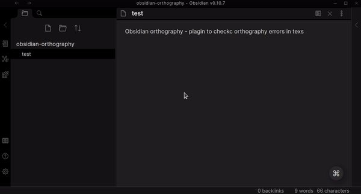

# Obsidian Orthography

&nbsp;

Obsidian plugin to check & fix orthography errors in text

## Hotkeys

| Keys | Description |
|---|---|
| Ctrl + Shift + l | Run the orthography checker |

## Features

* Search for spelling errors in the text
* Displaying options for correcting word mistakes
* Correct a word mistake in one click

## Issues

* WIP: [Do not deselect words when updating text](https://github.com/denisoed/obsidian-orthography/issues/1)
